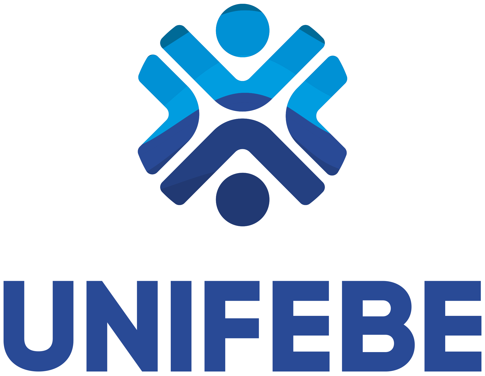

#  ColorSense: Capacitando a Inclusão Visual 

## _Repository with several subjects in Figma Html Css Python_

> _Practical content carried out in the classroom during Curricular Integration._
>
> - **_FIGMA - Vector graphics Online Editor._** 
> - **_HTML - Hyper Text Markup Language._**
> - **_CSS - Cascading Style Sheets._**
> - **_Python - Programming language._**

 
→ <a href="https://www.figma.com/file/JlTol6lbIt1brUM6MFGJ6U/ColorSense.com?type=design&node-id=0-1&mode=design&t=CN63vH5mxqP6cSHL-0">Meet my project at Figma to understand the ideia</a>   ←
    

 

---

##  Instructions for Execute the Project 

1. Instalação do Python: 
    - Acesse o site oficial do [Python](https://www.python.org/).
    - Clique no botão "Downloads".
    - Escolha a versão mais recente do Python (de preferência a versão 3.x) para o seu sistema operacional (Windows, macOS ou Linux).
    - Baixe o instalador e execute-o.
    - Certifique-se de marcar a opção "Add Python X.Y to PATH" durante a instalação (substitua X.Y pela versão específica que você está instalando).
    - Conclua a instalação seguindo as instruções na tela.

2. Configurando o VSCode para Python:
    - Baixe e instale o Visual Studio Code [VSCode](https://code.visualstudio.com/).
    - Abra o VSCode.
    - Instale a extensão "Python" da Microsoft. Para fazer isso, clique no ícone de extensões na barra lateral esquerda (ou use o atalho Ctrl+Shift+X), pesquise "Python" e instale a extensão oferecida pela Microsoft.
    - Crie uma nova pasta onde você deseja armazenar seu projeto.
    - Abra a pasta no VSCode. No VSCode, clique em "File" (Arquivo) no canto superior esquerdo e selecione "Open Folder" (Abrir Pasta).
    - Navegue até a que você baixou [Arquivo](https://github.com/ArthurEstevan/Unifebe_Project_ColorSense_2023/archive/refs/heads/main.zip).

3. Executando o Código:
    - Certifique-se de que você tenha a imagem que deseja analisar na mesma pasta do arquivo image_analysis.py.
    - No VSCode, clique com o botão direito do mouse dentro do arquivo image_analysis.py e escolha "Run Python File in Terminal" (Executar Arquivo Python no Terminal). Isso executará o seu código no terminal integrado do VSCode.
   
> _Certifique-se de que todas as etapas anteriores foram seguidas corretamente para garantir um ambiente de desenvolvimento adequado. Seu código deve ser executado no terminal e você verá a saída conforme definido no seu código._
---

##  About the Project

Bem-vindo ao Projeto ColorSense, uma plataforma web inovadora desenvolvida para aprimorar as experiências de indivíduos com deficiência visual. Nossa missão é fornecer uma solução inovadora que permita aos indivíduos enviar imagens, capacitando-os com a habilidade de compreender os elementos predominantes na área central dessas imagens.

Num mundo em que imagens transmitem uma riqueza de informações, o ColorSense se esforça para derrubar barreiras ao oferecer um serviço único que dá vida a conteúdos visuais por meio de meios auditivos. Ao aproveitar o poder da tecnologia avançada de reconhecimento de imagem, possibilitamos aos nossos usuários obter insights sobre o conteúdo das imagens que mais lhes interessam.

A plataforma ColorSense é um passo em direção ao fomento da inclusividade no cenário digital. Acreditamos que a deficiência visual não deve prejudicar a exploração e compreensão do mundo visual. Com esta plataforma, nosso objetivo é capacitar indivíduos com deficiência visual a interagir com imagens de maneira significativa, permitindo-lhes participar de forma mais plena na sociedade atual, orientada visualmente.

Junte-se a nós nessa jornada para transformar a forma como o conteúdo visual é percebido e compreendido. Juntos, podemos abrir novos caminhos de acessibilidade, independência e capacitação para a comunidade de deficientes visuais.

 

##  Project Demo Gift

 

 

 

